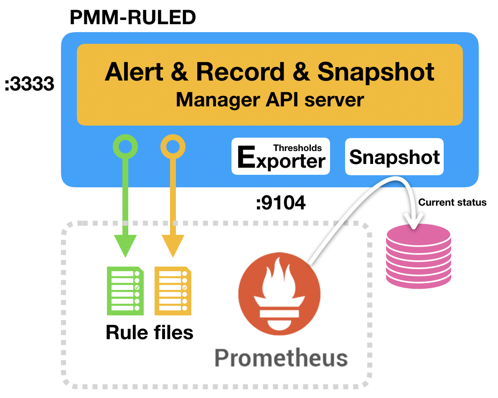

# PMM-RULED

## pmm-ruled is 
1. Alert Rule Manager
2. Record Rule Manager
3. Snapshot Rule Manager
4. Alert Thresholds Exporter
    
## Database setting

    create database `pmm-ruled`;
    create user ruled@127.0.0.1 identified by 'ruled';
    grant all on `pmm-ruled`.* to ruled;

## example config.ini
    [global]
    base = /pmm-rule
    exp_listen_port = :9104
    adm_listen_port = :3333
    #log_level = 5
    
    [snapshot]
    interval = 5
    tombstone_sec = 600
    row_key = instance
    
    [database]
    host = 127.0.0.1:3306
    user = ruled
    pass = ruled
    db = pmm-ruled
    #show_sql=1
    
    [prometheus]
    api = http://127.0.0.1:9090/prometheus
    timeout = 500
    rule_path = /etc/prometheus.d
    promtool = /usr/bin/promtool

## Build & Run

    ## package
    go get github.com/gin-gonic/gin
    go get github.com/Unknwon/goconfig
    go get github.com/go-easylog/el
    go get github.com/prometheus/client_golang/prometheus
    go get github.com/prometheus/client_golang/prometheus/promhttp
    go get github.com/prometheus/common/version
    go get github.com/go-sql-driver/mysql
    go get github.com/go-xorm/core
    go get github.com/go-xorm/xorm
    go get golang.org/x/sync/errgroup

    ## build and run
    cd pmm-ruled
    go build .
    ./pmm-ruled
    
## prometheus.yml
Set rule path and new job for alert thresholds exporter.
Prometheus will check every rules in target rule directory, and will do alerting or recording action.
To send alert to user, alertmanager must be setup.

    alerting:
      alertmanagers:
      - static_configs:
        - targets:
          - 127.0.0.1:19000
        scheme: http
        timeout: 10s

    rule_files:
    - /etc/prometheus.d/*.rule.yml

    scrape_configs:
    .. skip ..
    - job_name: alert
      honor_labels: true
      scrape_interval: 1m
      scrape_timeout: 5s
      metrics_path: /metric-rule
      scheme: http
      static_configs:
      - targets:
        - 127.0.0.1:9104
        labels:
      instance: alarm-manager
    .. skip ..

## alertmanager config.ini
This is some example configure file for alertmaneger web hook receiver.

    global:
      resolve_timeout: 5m
    route:
      group_by: ['alertname', 'level', 'instance']
      group_wait: 10s
      group_interval: 10s
      repeat_interval: 24h
      receiver: 'web.hook'
    receivers:
    - name: 'web.hook'
      webhook_configs:
      - url: 'http://127.0.0.1:5000/web-hook'

## 1. Alert Rule API
API to manage alert rules for prometheus

### 1. Alert rule API
Alert rule 

Action     |Method  |API
-----------|--------|-------------------------------------------------
NEW        |POST    |http://127.0.0.1:3333/pmm-rule/api/v1/alert/rule 
CHANGE     |PUT     |http://127.0.0.1:3333/pmm-rule/api/v1/alert/rule/{{rule_id}}
GET ONE    |GET     |http://127.0.0.1:3333/pmm-rule/api/v1/alert/rule/{{rule_id}}
GET ALL    |GET     |http://127.0.0.1:3333/pmm-rule/api/v1/alert/rules
REMOVE     |DELETE  |http://127.0.0.1:3333/pmm-rule/api/v1/alert/rule/{{rule_id}}

#### Parameters
parameter   |Decryption
------------|-----------------------------------------------
level       |alert level (info, warning, critical)
wait        |pending seconds before to be fired
opr         |operations ==,<,>,!=,<=,>=
val         |"global" alert thresholds
rule        |alert rule
subject     |subject
description |description
name        |alert name

#### example 
    curl -sk -X POST \
    -d 'level=critical' \
    -d 'wait=5' \
    -d 'opr===' \
    -d 'val=0' \
    --data-urlencode 'rule=up{job="mysql"}' \
    --data-urlencode 'subject=MySQL Agent Down' \
    --data-urlencode 'description=MySQL Agent Down' \
    --data-urlencode 'name=MySQL_Agent_Down' \
    http://127.0.0.1:3333/pmm-rule/api/v1/alert/rule

### 2. Alert group API
Service Group

Action        |Method  |API
--------------|--------|-------------------------------------------------
NEW           |POST    |http://127.0.0.1:3333/pmm-rule/api/v1/alert/group 
GET ONE       |GET     |http://127.0.0.1:3333/pmm-rule/api/v1/alert/group/{{group_id}}
GET ALL       |GET     |http://127.0.0.1:3333/pmm-rule/api/v1/alert/groups
REMOVE        |DELETE  |http://127.0.0.1:3333/pmm-rule/api/v1/alert/group/{{group_id}}
GET RULES     |GET     |http://127.0.0.1:3333/pmm-rule/api/v1/alert/group/{{group_id}}/rules
GET INSTANCES |GET     |http://127.0.0.1:3333/pmm-rule/api/v1/alert/group/{{group_id}}/instances

#### Parameters
parameter   |Decryption
------------|-----------------------------------------------
name        | group name

#### example 
    curl -s -X POST -d 'name=prod' http://127.0.0.1:3333/pmm-rule/api/v1/alert/group
    curl -s -X POST -d 'name=test' http://127.0.0.1:3333/pmm-rule/api/v1/alert/group
    
### 3. Group alert API
Specify an alert by group

Action  |Method  |API
--------|--------|-------------------------------------------------
NEW     |POST    |http://127.0.0.1:3333/pmm-rule/api/v1/group_rule/{{group_id}}/{{rule_id}}
CHANGE  |PUT     |http://127.0.0.1:3333/pmm-rule/api/v1/group_rule/{{group_id}}/{{rule_id}}
GET ONE |GET     |http://127.0.0.1:3333/pmm-rule/api/v1/group_rule/{{group_id}}
REMOVE  |DELETE  |http://127.0.0.1:3333/pmm-rule/api/v1/group_rule/{{group_id}}/{{rule_id}}

#### Parameters
parameter   |Decryption
------------|-----------------------------------------------
val         | "group" alert thresholds

#### example 
    ## Set instance 1, group 1
    curl -s -X POST http://127.0.0.1:3333/pmm-rule/api/v1/alert/group_rule/1/1

    ## Change threshold for group 1, Every instance in "group 1" affected by this threshold
    curl -s -X POST -d 'val=5' http://127.0.0.1:3333/pmm-rule/api/v1/alert/group_rule/1/1

### 4. Alert Instance API
Alert target to send to. The Instance must be included in the group. 
Instances also gathered by batch process from prometheus

Action         |Method  |API
---------------|--------|-------------------------------------------------
CHANGE         |PUT     |http://127.0.0.1:3333/pmm-rule/api/v1/alert/instance/{{instance_id}}
GET ONE        |GET     |http://127.0.0.1:3333/pmm-rule/api/v1/alert/instance/{{instance_id}}
GET ALL        |GET     |http://127.0.0.1:3333/pmm-rule/api/v1/alert/instances
REMOVE         |DELETE  |http://127.0.0.1:3333/pmm-rule/api/v1/alert/instance/{{instance_id}}
GET RULES      |GET     |http://127.0.0.1:3333/pmm-rule/api/v1/alert/instance/{{instance_id}}/rules
GET SKIP RULES |GET     |http://127.0.0.1:3333/pmm-rule/api/v1/alert/instance/{{instance_id}}/skip_rules

#### Parameters
parameter   |Decryption
------------|-----------------------------------------------
group_id    | group id which instance involved
instance    | instance name 

#### example
    curl -s -X GET http://127.0.0.1:3333/pmm-rule/api/v1/alert/instances
    curl -s -X PUT -d 'group_id=1' http://127.0.0.1:3333/pmm-rule/api/v1/alert/instance/1
    curl -s -X PUT -d 'group_id=2' http://127.0.0.1:3333/pmm-rule/api/v1/alert/instance/2

### 5. Alert Rule for Instance API    
Instance-specific Alert rule management

Action  |Method  |API
--------|--------|-------------------------------------------------
NEW     |POST    |http://127.0.0.1:3333/pmm-rule/api/v1/alert/instance_rule/{{instance_id}}/{{rule_id}}
CHANGE  |PUT     |http://127.0.0.1:3333/pmm-rule/api/v1/alert/instance_rule/{{instance_id}}/{{rule_id}}
REMOVE  |DELETE  |http://127.0.0.1:3333/pmm-rule/api/v1/alert/instance_rule/{{instance_id}}/{{rule_id}}

#### Parameters
parameter   |Decryption
------------|-----------------------------------------------
val         | "instance" alert thresholds

#### example
    curl -s -X POST http://127.0.0.1:3333/pmm-rule/api/v1/alert/instance_rule/1/1
    curl -s -X POST -d 'val=5' http://127.0.0.1:3333/pmm-rule/api/v1/alert/instance_rule/1/1

### 6. Skip alert rules
Instance-specific "Ignored" alert rule management

Action  |Method  |API
--------|--------|-------------------------------------------------
NEW     |POST    |http://127.0.0.1:3333/pmm-rule/api/v1/alert/skip_rule/{{instance_id}}/{{rule_id}}
REMOVE  |DELETE  |http://127.0.0.1:3333/pmm-rule/api/v1/alert/skip_rule/{{instance_id}}/{{rule_id}}

#### Parameters
parameter   |Decryption
------------|-----------------------------------------------
val         | "instance" alert thresholds

#### example
    curl -s -X POST http://127.0.0.1:3333/pmm-rule/api/v1/alert/instance_rule/1/1
    curl -s -X POST -d 'val=5' http://127.0.0.1:3333/pmm-rule/api/v1/alert/instance_rule/1/1

### 7. Alert rule flush
Alert rule flushed to "rule_path" in config.ini

Action     |Method  |API
-----------|--------|-------------------------------------------------
RULE FLUSH |GET     |http://127.0.0.1:3333/pmm-rule/api/v1/alert/flush

#### example
curl -s -X GET http://127.0.0.1:3333/pmm-rule/api/v1/alert/flush

## 2. Record Rule API
API to manage record rules for prometheus.
Rule files for 5s, 1m, 5m, 1h each are generated.
- record rule 5s : as raw data, record from registed rule
- record rule 1m : avg/min/max from 5s result
- record rule 5m : avg/min/max from 5s result
- record rule 1h : avg/min/max from 5m result

Action     |Method  |API
-----------|--------|-------------------------------------------------
NEW        |POST    |http://127.0.0.1:3333/pmm-rule/api/v1/record/rule 
GET ONE    |GET     |http://127.0.0.1:3333/pmm-rule/api/v1/record/rule/{{rule_id}}
GET ALL    |GET     |http://127.0.0.1:3333/pmm-rule/api/v1/record/rules
REMOVE     |DELETE  |http://127.0.0.1:3333/pmm-rule/api/v1/record/rule/{{rule_id}}
RULE FLUSH |GET     |http://127.0.0.1:3333/pmm-rule/api/v1/record/rule/flush

#### Parameters
parameter   |Decryption
------------|-----------------------------------------------
name        |record rule name
query       |promql for first record data(5s)
stat_yn     |Y: avg/min/max without snap metric
            |N: no avg/min/max, only snap metric

#### example 
    curl -X POST \
     -d "name=ckpt_age_pct" \
     -d 'query=100 * (mysql_global_status_innodb_checkpoint_age / mysql_global_status_innodb_checkpoint_max_age)' \
     -d 'stat_yn=Y' \
    http://127.0.0.1:3333/pmm-rule/api/v1/record/rule

    curl -X PUT  -d 'stat_yn=N' http://127.0.0.1:3333/pmm-rule/api/v1/record/rule/1
    curl -X DELETE  http://127.0.0.1:3333/pmm-rule/api/v1/record/rule/1
    curl -X GET http://127.0.0.1:3333/pmm-rule/api/v1/record/rule/flush

## 3. Snapshot Rule API
API to store in MySQL database from promql result.
This is for getting current Instance status.

Action      |Method  |API
------------|--------|-------------------------------------------------
NEW         |POST    |http://127.0.0.1:3333/pmm-rule/api/v1/snapshot/rule 
GET ONE     |GET     |http://127.0.0.1:3333/pmm-rule/api/v1/snapshot/rule/{{rule_id}}
GET ALL     |GET     |http://127.0.0.1:3333/pmm-rule/api/v1/snapshot/rules
REMOVE      |DELETE  |http://127.0.0.1:3333/pmm-rule/api/v1/snapshot/rule/{{rule_id}}
GET METRICS |GET     |http://127.0.0.1:3333/pmm-rule/api/v1/snapshot/rule/{{rule_id}}/metrics

#### Parameters
parameter   |Decryption
------------|-----------------------------------------------
name        |record rule name
label       |label value stored at str_value in snapshot_metric table
query       |promql for snapshot metric

#### example 
    curl -X POST \
     -d "name=mysql_io_thread" \
     -d 'query=mysql_slave_status_slave_io_running' \
     -d 'label=master_host' \
    http://127.0.0.1:3333/pmm-rule/api/v1/snapshot/rule

    curl -X PUT -d 'stat_yn=N' http://127.0.0.1:3333/pmm-rule/api/v1/snapshot/rule/1
    curl -X DELETE  http://127.0.0.1:3333/pmm-rule/api/v1/snapshot/rule/1

## 4. Alert thresolds exporter
API to store in MySQL database from promql result.
This is for getting current Instance status.

#### Exporter
    http://127.0.0.1:9104/metric-rule

## Contacts
- email: gywndi@gmail.com, chan.c@kakaobank.com
- sites : https://gywn.blog, http://gywn.net, https://github.com/gywndi
- @kakaobank, https://kakaobank.com
